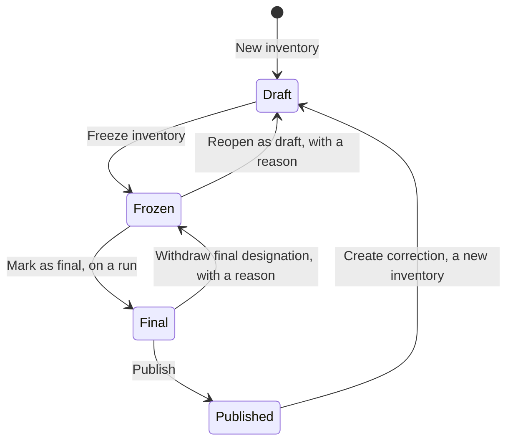

# What is the inventory lifecycle?

The inventory lifecycle is the path from an editable draft to a published
report that never changes; some steps ask for a reason and others are
refused.

<!-- sources: concepts/the-inventory-lifecycle.md (verified 2026-09-24); specs 05.1, 05.2, 05.3, 05.5, 05.7; LifecycleBar.tsx stateCopy; RunDetailPage.tsx header ("Report version", "supersedes"); badges.tsx ("inherited"); lifecycle card and dialog texts from the Gye Nyame Gold walkthrough of 2026-09-28 (replay-log.txt): "5 workbench", "7 freeze dialog", "7 after freeze", "8 after final", "8 publish dialog", "8 after publish" -->

## Which states does an inventory pass through?

| State | The lifecycle card says | You can | You cannot |
| --- | --- | --- | --- |
| Draft | "runs are blocked until the inventory is frozen" | Edit the boundary, the declaration, the rules and every classification. | Launch a run. |
| Frozen | "The boundary and the activity view are read-only and runs are allowed." | **Launch calculation run**, void a run, **Reopen as draft** with a reason. | Change anything a run reads. |
| Final | "A run is designated the final result." | **Publish**, or **Withdraw final designation** with a reason. | Reopen. |
| Published | "The report was issued; nothing on this inventory can change." | Read the report as issued, **Create correction**. | Change anything. |

## Why a freeze cuts a version

A run needs a boundary that does not move under it. Freezing writes a
boundary version: every entity and facility in the boundary with its
share and membership window, and every exclusion with its reason. The
freeze dialog says so: "This freezes the boundary and the activity view
together and cuts boundary version 1: an immutable record of the 2
facilities currently in the boundary with their accounting shares.
Calculation runs will cite this version." Each run's report names the
version it used.

A report version counts the inventories of one period: "Report version
1", then "Report version 2, supersedes" and the earlier inventory's name
on a correction.

## What does a correction do?

Publishing is irreversible: "nothing on this inventory can change
afterwards. A correction is a new inventory that supersedes it." The
correction is a new draft over the same period that inherits every
decision, each marked "inherited". You change what was wrong, freeze,
run and publish; the earlier report stays readable and says it is
superseded.

## Where next

- [Freeze the inventory and launch a run](freeze-and-launch-a-run.md).
- [What is a calculation run?](what-is-a-calculation-run.md).
- [Correct a published inventory](../reporting/correct-a-published-inventory.md).
