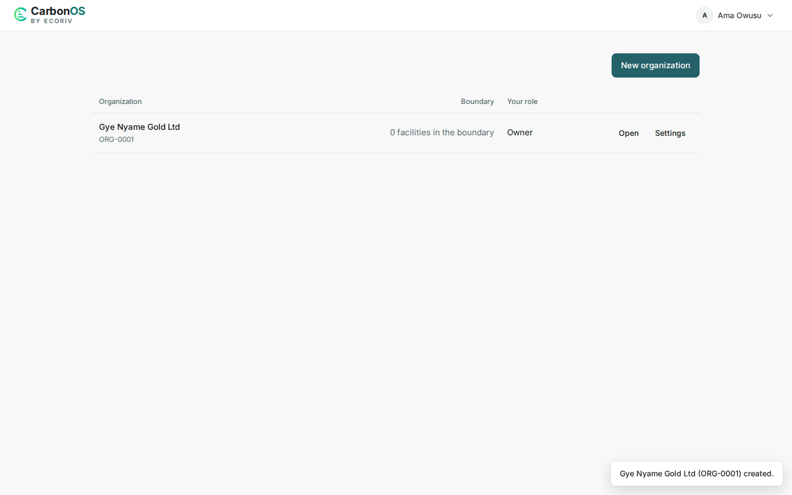

# Create an organization

An organization is the reporting company and everything under it: legal entities, facilities, activity data, factors, inventories, and runs. You create it once, before anything else, and whoever creates it becomes its owner.

<!-- sources: specs 01.3, 01.5, 01.8 and 10 (the organizations table, the rail); QA governance 002 A1 and A3; old page tasks/organization/create-an-organization.md (verified 2026-09-26); OrganizationsPage.tsx, OrganizationFormModal.tsx, DuplicateNameNotice.tsx, AdminSettingsPage.tsx, DuplicateOrganizationNameException.java, GhgService.java (createOrganization, firstOwner); screen text and figures from the Gye Nyame Gold walkthrough of 2026-09-28 (replay-log.txt): "1 ghg landing", "1 new org dialog", "1 org card", "1 overview", "3 toasts" -->

## Before you start

- A signed-in account. An account with no organization lands on the organizations list; from inside one, **All organizations** at the foot of the rail leads back.
- On a deployment whose platform setting **Who may create an organization** is "Administrators only", **New organization** is not offered. Ask a platform administrator to create the organization and name you as its owner.

## Create the organization

1. On the organizations list, click **New organization**.
2. Fill **Name**, for example `Gye Nyame Gold Ltd`.
3. Fill **Address (optional)** if the report should carry it: "Printed in the report header as the reporting entity's address."
4. Fill **Contact (optional)** with the address a reader of the report should write to.
5. Click **Create organization**.

What you see: "Gye Nyame Gold Ltd (ORG-0001) created." and a row in the organizations table with the name over the account number, "0 facilities in the boundary", your role, and **Open** and **Settings**. **Open** leads to the organization's **Overview**, whose four numbered steps are the order the rest of the setup goes in.

## Read the account number

CarbonOS assigns an account number when the organization is created, `ORG-0001` for the first one on a deployment, and prints it with the name everywhere, from the list to the report. It never changes, whatever the name becomes.

## Use a name another organization already carries

If another organization already has the name, the form stops once and names it: "An organization named '*name*' already exists: *other* (ORG-*NNNN*). Confirm to use the name anyway." Check the account number. If yours is a different company, click **Create anyway**. If it is the same one, change the name, or ask that organization's owner to add you as a member instead.

## Name somebody else as owner

Only a platform administrator sees **Owner's email (optional)**: "An existing account, which becomes the organization's owner. Leave it empty to own it yourself. Naming somebody else means you are not a member, so you will need support access to open it." The client, not the platform team, then holds the organization's membership and deletion rights.

## What happens next

Only an owner sees **Settings**, where the members are added; see [Add members and assign roles](add-members-and-assign-roles.md). A platform administrator can see that the organization exists, its owners and its member count, and nothing inside it; see [What is support access?](../access/what-is-support-access.md). To change the name, address or contact later, see [Edit the organization's details and read its history](edit-the-details-and-read-the-history.md).
