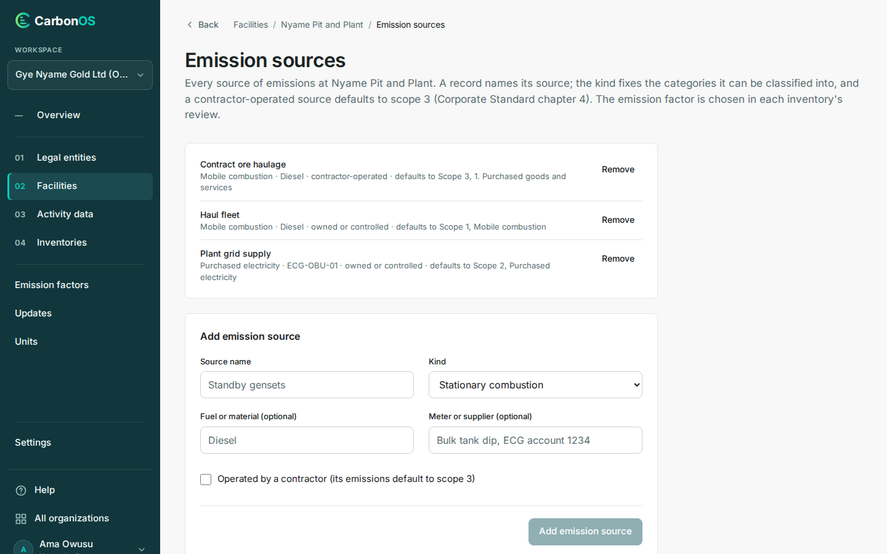

# Record facilities and emission sources

A facility is a site, and an emission source is one source of emissions at it: a generator, a boiler, a haul fleet, a grid supply. A record names both. Register the sources here when you know them, or describe one on the record itself when the invoice arrives; see [Enter a record](../activity-data/enter-a-record.md#describe-a-new-emission-source-on-the-record).

<!-- sources: specs 03, 04.1, 04.3, 04.7, 04.10; QA governance 002 D; FacilitiesPage.tsx, FacilityFormPage.tsx, EmissionSourcesPage.tsx, RemoveDialog.tsx, StreamKind.java, GhgRules.java (ghg.stream.has-records), GhgService.java (deleteFacility, deleteStream, createStreamAt), StructureChanges.java (the history reasons); screen text and figures from the local walkthrough of 2026-10-04 (Gye Nyame Gold on the ECO-5 branch) -->

## Before you start

- You are a preparer, reviewer or owner.
- The legal entity the site belongs to exists; see [Record legal entities](record-legal-entities.md).

## Add a facility

1. Open **Facilities** and click **Add facility**. The form takes the page, under the breadcrumb **Facilities › Add facility**.
2. Fill **Name** and **Location**, for example `Nyame Pit and Plant` and `Obuasi, Ghana`.
3. Fill **Country (optional)** with the ISO 3166-1 alpha-2 code, for example `GH`.
4. Fill **Grid region (optional)** only for a grid the country does not imply.
5. Choose **Facility type (optional)**, from Office to Other.
6. Choose **Lease (optional)**, with **Lease from (optional)** and **Lease until (optional)**, if the site is leased in or out.
7. Choose **Legal entity**, for example "Gye Nyame Gold Ltd (Reporting company)".
8. Click **Add facility**.

What you see: "Nyame Pit and Plant added." and a row with the location, the type and grid ("Mine · grid GHA"), the lease, the entity, and **Emission sources**, **Edit** and **Remove**.

## Add emission sources

1. In the facility's row, click **Emission sources**. The page opens under the breadcrumb **Facilities › Nyame Pit and Plant › Emission sources**; a facility with none yet reads "No emission sources registered yet."
2. Under **Add emission source**, fill **Source name**, for example `Haul fleet`.
3. Choose **Kind**, from Stationary combustion to Other.
4. Fill **Fuel or material (optional)** and **Meter or supplier (optional)** as the invoices name them. For a grid supply the meter or account number is the source's handle.
5. Tick **Operated by a contractor (its emissions default to scope 3)** when a contractor runs the source.
6. Click **Add emission source**. The name, fuel and meter clear; the kind and the contractor box keep their state, so the next source of the same kind takes two fields. Click **Facilities** in the breadcrumb when the list is complete.

What you see: "Haul fleet added to Nyame Pit and Plant." and a line per source with the default it gives its records: "Mobile combustion · Diesel · owned or controlled · defaults to Scope 1, Mobile combustion". A source created on the activity form carries "added during data entry" at the end of its line, so a reviewer can tell the two apart.

## What each kind defaults to

The twelve kinds are Stationary combustion, Mobile combustion, Process, Fugitive, Purchased electricity, Purchased heat, steam or cooling, Waste, Transport, Business travel, Employee commuting, Purchased goods and services, and Other. Owned or controlled, the first four default to scope 1, the next two to scope 2, and the rest to the kind's own scope 3 category; a contractor-operated source defaults to scope 3 whatever its kind. The emission factor is not on the source: each inventory chooses it when the record is classified. See [What is an emission source?](what-is-an-emission-source.md).

## Names at one facility

A facility's sources have different names. A name it already carries is refused: "'Nyame Pit and Plant' already has an emission source named 'haul fleet'." On the activity form, a name close to an existing one is answered with the existing source to choose from; here, on the register, only the exact name is checked.

## Remove a facility or a source

**Remove** on a facility asks for a **Reason** of at least 5 characters and keeps it on file as removed; it is refused while the facility has activity records or sits in an unpublished inventory's boundary. **Remove** on a source asks "Remove emission source?" and needs no reason; it is refused while records name it: "'Haul fleet' has activity records. Move them to another emission source before deleting it."

The organization's history records adding, editing and removing a facility, with the old and new values of an edit and the reason for a removal, and adding and removing a source, with "during data entry" and the reason given beside a similar name when that is how it was created; see [Read the history](edit-the-details-and-read-the-history.md#read-the-history).

## What happens next

Records name the facility and the source, matched by name on import; one classified under its source's default needs no justification.
