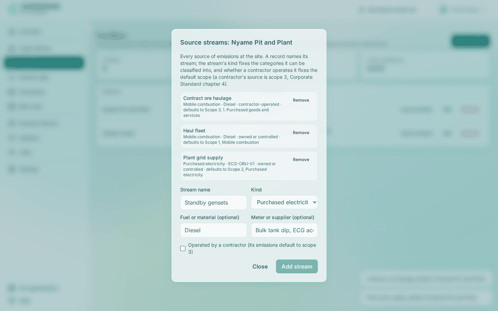

# Record facilities and source streams

A facility is a site, and a source stream is one source of emissions at it. Every activity record names both, so record them before the first record.

<!-- sources: specs 03, 04.1, 04.3, 04.7; old page tasks/organization/record-facilities-and-source-streams.md (verified 2026-09-24); FacilitiesPage.tsx, FacilityFormModal.tsx, StreamsModal.tsx, RemoveDialog.tsx, StreamKind.java, GhgService.java (deleteFacility, deleteStream); screen text and figures from the Gye Nyame Gold walkthrough of 2026-09-28 (replay-log.txt): "2 facility dialog", "2 facilities", "2 streams dialog empty", "2 streams Nyame Pit and Plant", "2 streams Obuasi Camp", "3 toasts" -->

## Before you start

- You are a preparer, reviewer or owner.
- The legal entity the site belongs to exists; see [Record legal entities](record-legal-entities.md).

## Add a facility

1. Open **Facilities** and click **Add facility**.
2. Fill **Name** and **Location**, for example `Nyame Pit and Plant` and `Obuasi, Ghana`.
3. Fill **Country (optional)** with the ISO 3166-1 alpha-2 code, for example `GH`.
4. Fill **Grid region (optional)** only for a grid the country does not imply.
5. Choose **Facility type (optional)**, from Office to Other.
6. Choose **Lease (optional)**, with **Lease from (optional)** and **Lease until (optional)**, if the site is leased in or out.
7. Choose **Legal entity**, for example "Gye Nyame Gold Ltd (Reporting company)".
8. Click **Add facility**.

What you see: "Nyame Pit and Plant added." and a row with the location, the type and grid ("Mine · grid GHA"), the lease, the entity, and **Source streams**, **Edit** and **Remove**.

## Add source streams

1. In the facility's row, click **Source streams**.
2. Fill **Stream name**, for example `Haul fleet`.
3. Choose **Kind**, from Stationary combustion to Other.
4. Fill **Fuel or material (optional)** and **Meter or supplier (optional)** as the invoices name them.
5. Tick **Operated by a contractor (its emissions default to scope 3)** when a contractor runs the source.
6. Click **Add stream**, and **Close** when the list is complete.

What you see: "Haul fleet added to Nyame Pit and Plant." and a line per stream with the default it gives its records: "Mobile combustion · Diesel · owned or controlled · defaults to Scope 1, Mobile combustion".

## What each kind defaults to

The twelve kinds are Stationary combustion, Mobile combustion, Process, Fugitive, Purchased electricity, Purchased heat, steam or cooling, Waste, Transport, Business travel, Employee commuting, Purchased goods and services, and Other. Owned or controlled, the first four default to scope 1, the next two to scope 2, and the rest to the kind's own scope 3 category; a contractor-operated stream defaults to scope 3 whatever its kind.

## Remove a facility or a stream

**Remove** on a facility asks for a **Reason** of at least 5 characters and keeps it on file as removed; it is refused while the facility has activity records or sits in an unpublished inventory's boundary. A stream needs no reason and is refused while records name it.

## What happens next

Records name the facility and stream, matched by name on import; one classified under its stream's default needs no justification.
