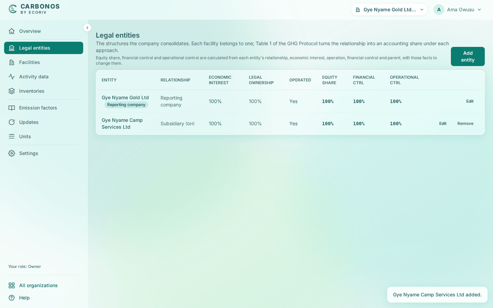

# Record legal entities

A legal entity is a structure the company consolidates: a subsidiary, a joint venture, an associate. Record each one before its facilities, because the entity's facts set the accounting share.

<!-- sources: specs 03.1 to 03.4; old page tasks/organization/record-legal-entities.md (verified 2026-09-24); EntitiesPage.tsx, EntityFormPage.tsx, RemoveDialog.tsx, GhgService.java (requireParent, updateEntity, deleteEntity, requireReason), StructureChanges.java (the history reasons, spec 01.7 as amended 2026-09-29); screen text and figures from the Gye Nyame Gold walkthrough of 2026-09-28 (replay-log.txt): "1 entities", "1 entity dialog", "1 entities after", "3 toasts", "5 inventory dialog" -->

## Before you start

- You are a preparer, reviewer or owner.
- The reporting company is already listed, tagged "Reporting company", at 100% under every approach; it cannot be removed.

## Add an entity

1. Open **Legal entities** and click **Add entity**. The form takes the page, under the breadcrumb **Legal entities › Add legal entity**.
2. Fill **Name**, for example `Gye Nyame Camp Services Ltd`.
3. Choose **Relationship**, a row of Table 1 (listed below); for a wholly owned subsidiary, "Group company or subsidiary (financial control)".
4. Fill **Economic interest (%)** and, for disclosure, **Legal ownership (%)**.
5. Leave **Operated by the company** ticked if the company or a subsidiary operates the entity.
6. Leave **Financial control** as "Follows the Table 1 row" unless the company's control differs; an override asks for a **Basis of the decision**.
7. Choose **Held through**: "Held directly by the reporting company", or the parent it is held through.
8. Fill **Acquired on (optional)** and **Disposed of on (optional)** if the entity joined or left mid-year.
9. Fill **Jurisdiction (optional)** with the ISO 3166-1 alpha-2 code, for example `GH`.
10. Click **Add entity**.

What you see: "Gye Nyame Camp Services Ltd added." and a row with the relationship, the jurisdiction, the percentages and **Operated**, then the share under **Equity share**, **Financial ctrl** and **Operational ctrl**: 100% in all three for an operated, wholly owned subsidiary.

## The five relationships

The **Relationship** list is Table 1 of the Corporate Standard: "Group company or subsidiary (financial control)", "Joint venture, partnership or operation (joint financial control)", "Associate or affiliate (significant influence, no control)", "Fixed-asset investment (no significant influence)" and "Franchise (consolidated only with equity rights or control)".

## Held-through chains

An entity held through another takes the parent's share times its own, and a chain cannot loop: "'*Parent*' is held through '*Entity*': a parent chain cannot loop."

## Edit or remove an entity

**Edit** opens the same fields as **Add entity** and changes the entity's facts for every future boundary; existing inventories keep their decisions. Under the fields, **Share under each approach** shows the entity's **Equity share**, **Financial control** and **Operational control** as last saved. Those shares are Table 1's result, not inputs: change the relationship, economic interest, operation, financial control or parent to change them. The reporting company's form shows every field, but its structure is fixed at 100% and operated: only **Name**, the two dates and **Jurisdiction** can change. The organization's history records each edit with the old and new values, for example "economic interest 100% → 60%"; see [Read the history](edit-the-details-and-read-the-history.md#read-the-history).

**Remove** asks for a **Reason** of at least 5 characters, keeps the entity on file as removed and writes the reason to the history. It is refused while a facility belongs to the entity or another entity is held through it: "'*Entity*' still has facilities. Move them to another entity before deleting it."

## What happens next

The entity can now be a facility's **Legal entity**; see [Record facilities and emission sources](record-facilities-and-emission-sources.md). Its share under each approach is explained in [What is a consolidation approach?](what-is-a-consolidation-approach.md).
