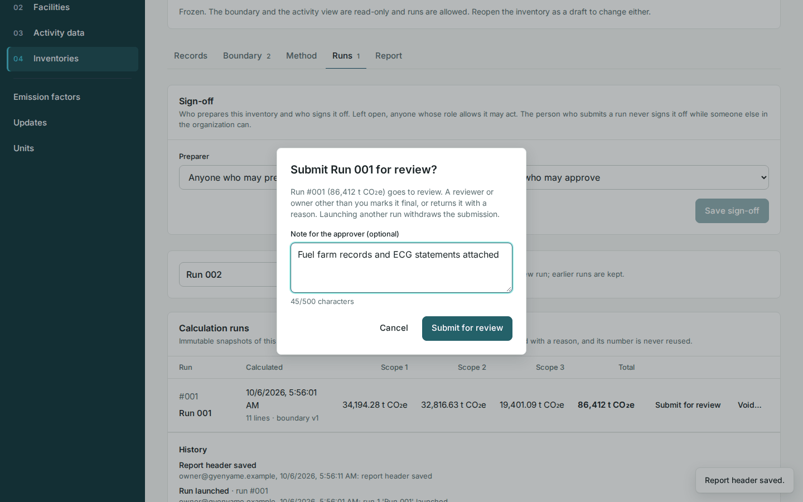

# Designate a final run and publish

A run becomes the inventory's result in two acts: the preparer submits it for review, and a reviewer or owner who did not submit it marks it as final. Publishing then issues its report.

<!-- sources: specs 05.1, 05.5, 05.8 (the sign-off workflow) and 07.4, and 02.6 (the published-period setting, amended 2026-09-29); old page tasks/inventories/designate-a-final-run-and-publish.md (verified 2026-09-24); frontend/src/features/ghg/components/LifecycleBar.tsx (state copy, the withdraw and publish dialogs, the disabled Publish button); spec 10 (the lifecycle acts in the title row); backend/src/main/java/com/carbonos/ghg/internal/InventoryService.java (refuseWhileARecalculationHolds); screen text and figures from the Gye Nyame Gold walkthrough of 2026-10-06 (walkthrough-log.txt): "8 submit dialog", "8 after submit", "8 final dialog", "8 after final", "8 publish dialog", "8 after publish", "8 run after publish" -->

## Before you start

- The inventory is frozen and has a run on its **Runs** tab; see [Freeze and launch a run](../inventories/freeze-and-launch-a-run.md).
- Submitting needs the Preparer, Reviewer or Owner role. Marking a run as final, returning it and publishing need the Reviewer or Owner role. While nothing is signed off, **Publish** is disabled with "Submit a run for review and have it marked final first".

## Submit the run for review

1. Open the inventory's **Runs** tab and click **Submit for review** on the run.
2. Read the dialog "Submit Run 001 for review?": "Run #001 (86,412 t CO₂e) goes to review. A reviewer or owner other than you marks it final, or returns it with a reason. Launching another run withdraws the submission."
3. Fill **Note for the approver (optional)**, up to 500 characters, and click **Submit for review**.

What you see: "Run 001 submitted for review." The status chip reads "IN REVIEW · BOUNDARY v1", the run's row carries the tag IN REVIEW, and **Inventory lifecycle** reads "Submitted for review by" your name, the date and your note.

## Mark the submitted run as final

1. On the **Runs** tab click **Mark as final** on the run tagged IN REVIEW.
2. Read the dialog "Mark Run 001 as final?": "Run #001 (86,412 t CO₂e) becomes this inventory's final run: the report and the base year attach to it, and the inventory can be published."
3. Fill **Review note (optional)**, up to 500 characters, with what you checked, for example `Reconciled against the fuel farm records and the ECG statements`.
4. Click **Mark as final**.

What you see: "Run 001 designated final." The status chip reads "FINAL · BOUNDARY v1", the run's row carries the tag FINAL, and the report header names who submitted the run and who signed it off.

You cannot sign off a run you submitted while someone else in the organization may approve: **Mark as final** is disabled with "You submitted this run; another reviewer or owner signs it off." Where nobody else may approve, as in an organization with one owner, your sign-off goes through as a self-approval, and the report header says "self-approved: nobody else in the organization could check it".

!!! note "What holds the designation"
    Submitting and **Mark as final** are refused while a record the run used has an unapproved factor ("'*record*' uses '*factor*', which is not approved."), and while the base year has an undecided recalculation candidate above its significance threshold; see [Decide a recalculation candidate](decide-a-recalculation-candidate.md).

## Return it to the preparer

1. In the title row click **Return to preparer**.
2. In the dialog "Return the inventory to the preparer?" fill **Reason** with at least 5 characters, and click **Return to preparer**.

What you see: "Inventory returned to the preparer." The status chip reads "FROZEN · BOUNDARY v1" again and the history keeps your reason. Launching another run, voiding the submitted run or reopening the inventory also withdraws a submission, and the history says which.

## Name the preparer and the approver

On the **Runs** tab, **Sign-off** names who prepares the inventory and who signs it off. Choose a member under **Preparer** and **Approver** and click **Save sign-off**. Once named, only that preparer submits and only that approver returns or signs off; left at "Anyone who may prepare" and "Anyone who may approve", the roles decide. A reviewer or owner names them, until the inventory is published.

## Withdraw the designation

1. In the title row click **Withdraw final designation**.
2. Read the dialog "Withdraw the final designation?": "The run stays on the record; the inventory returns to frozen."
3. Fill **Reason** with at least 5 characters and click **Withdraw designation**.

What you see: "Final designation withdrawn." The status chip reads "FROZEN · BOUNDARY v1" again, and the run keeps its place on the **Runs** tab.

## Publish

1. In the title row click **Publish**.
2. Read the dialog "Publish the inventory?": "Publishing issues the report; nothing on this inventory can change afterwards. A correction is a new inventory that supersedes it."
3. Click **Publish**.

What you see: "Inventory published." The status chip reads "PUBLISHED · BOUNDARY v1", the fields of the **Report** tab are disabled, and the only action left is **Create correction**.

## What happens next

Section 00 of the final run reads "Published 10/6/2026, 5:56:18 AM by owner@gyenyame.example" and gains the block **Since publication**. A factor pack edition that applies inside the published period can no longer be imported or accepted, unless the platform setting **Editions inside a published period** allows it; the published report keeps its figures either way. To restate the year, see [Correct a published inventory](correct-a-published-inventory.md); to name the base year, see [Designate the base year](designate-the-base-year.md).
