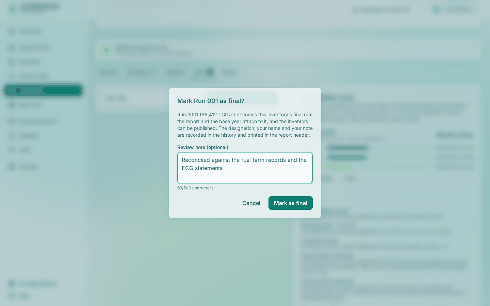

# Designate a final run and publish

Marking a run as final names the run that stands as the inventory's result, and publishing issues its report. You do this once the review is complete and the figures are agreed.

<!-- sources: specs 05.1, 05.5 and 07.4, and 02.6 (the published-period setting, amended 2026-09-29); old page tasks/inventories/designate-a-final-run-and-publish.md (verified 2026-09-24); frontend/src/features/ghg/components/LifecycleBar.tsx (state copy, the withdraw and publish dialogs, the disabled Publish button); backend/src/main/java/com/carbonos/ghg/internal/InventoryService.java (refuseWhileARecalculationHolds); screen text and figures from the Gye Nyame Gold walkthrough of 2026-09-28 (replay-log.txt): "8 final dialog", "8 after final", "8 publish dialog", "8 after publish", "8 run after publish" -->

## Before you start

- The inventory is frozen and has a run on its **Runs** tab; see [Freeze and launch a run](../inventories/freeze-and-launch-a-run.md).
- You hold the Reviewer or Owner role. While the inventory is frozen, **Publish** is disabled with "Designate a final run first".

## Mark a run as final

1. Open the inventory's **Runs** tab and click **Mark as final** on the run.
2. Read the dialog "Mark Run 001 as final?": "Run #001 (86,412 t CO₂e) becomes this inventory's final run: the report and the base year attach to it, and the inventory can be published."
3. Fill **Review note (optional)**, up to 500 characters, with what you checked, for example `Reconciled against the fuel farm records and the ECG statements`.
4. Click **Mark as final**.

What you see: "Run 001 designated final." The header reads "FINAL · BOUNDARY v1", the run's row carries the tag FINAL, and the lifecycle card reads "Final. A run is designated the final result. Withdraw the designation to reopen the inventory, or publish it to issue the report."

!!! note "What holds the designation"
    **Mark as final** is refused while a record the run used has an unapproved factor ("'*record*' uses '*factor*', which is not approved."), and while the base year has an undecided recalculation candidate above its significance threshold; see [Decide a recalculation candidate](decide-a-recalculation-candidate.md).

## Withdraw the designation

1. In the **Inventory lifecycle** card click **Withdraw final designation**.
2. Read the dialog "Withdraw the final designation?": "The run stays on the record; the inventory returns to frozen."
3. Fill **Reason** with at least 5 characters and click **Withdraw designation**.

What you see: "Final designation withdrawn." The header reads "FROZEN · BOUNDARY v1" again, and the run keeps its place on the **Runs** tab.

## Publish

1. In the **Inventory lifecycle** card click **Publish**.
2. Read the dialog "Publish the inventory?": "Publishing issues the report; nothing on this inventory can change afterwards. A correction is a new inventory that supersedes it."
3. Click **Publish**.

What you see: "Inventory published." The header reads "PUBLISHED · BOUNDARY v1", the fields of the **Report** tab are disabled, and the only action left is **Create correction**.

## What happens next

Section 00 of the final run reads "Published 9/28/2026, 4:32:34 PM by owner@gyenyame.example" and gains the block **Since publication**. A factor pack edition that applies inside the published period can no longer be imported or accepted, unless the platform setting **Editions inside a published period** allows it; the published report keeps its figures either way. To restate the year, see [Correct a published inventory](correct-a-published-inventory.md); to name the base year, see [Designate the base year](designate-the-base-year.md).
