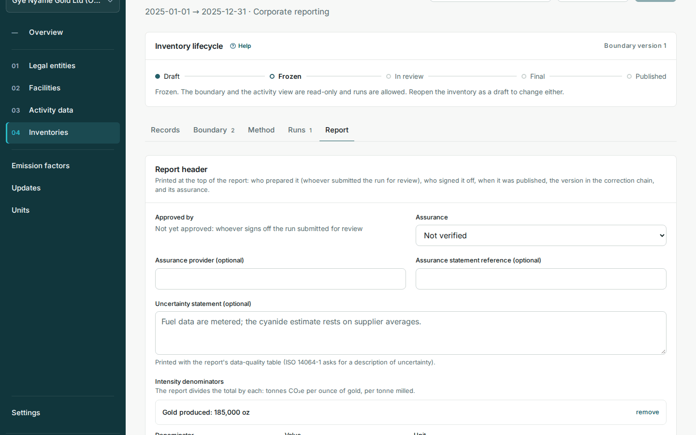

# Fill the report header and read the report

A run's page is the report; the inventory's **Report** tab holds the header printed at its top, and the run page reads it live.

<!-- sources: spec 05.8 (the sign-off workflow), its strings checked in the Gye Nyame Gold walkthrough of 2026-10-06 (walkthrough-log.txt); specs 07.1 to 07.6 (the report), 07.4 (report metadata and intensity), 07.7 (emissions by gas); old page tasks/reporting/read-the-report-and-fill-the-header.md (verified 2026-09-24); frontend/src/features/ghg/components/ReportMetadataCard.tsx (labels, hints, placeholders, disabled once published); frontend/src/features/ghg/RunDetailPage.tsx (sections); screen text and figures from the Gye Nyame Gold walkthrough of 2026-09-28 (replay-log.txt): "8 report tab", "8 header filled", "7 run page", "8 run after publish" -->

## Before you start

- Any member can read a run's report; filling the header needs the Preparer, Reviewer or Owner role.
- The header is disabled once the inventory is published.

## Fill the report header

1. Open the inventory's **Report** tab. **Approved by** is not typed: it reads "Not yet approved: whoever signs off the run submitted for review" until the sign-off, and then names who signed.
2. Choose **Assurance**: "Not verified", "Limited assurance" or "Reasonable assurance", with **Assurance provider (optional)** and **Assurance statement reference (optional)** where they apply.
3. Fill **Uncertainty statement (optional)**.
4. Under **Intensity denominators** fill **Denominator**, **Value** and **Unit**, then click **Add denominator**.
5. Click **Save report header**.

What you see: "Report header saved." The denominator is listed above the fields, for Gye Nyame Gold "Gold produced: 185,000 oz". Section 00 of the run shows the assurance, and section 04 gains an **Intensity** line per denominator: "0.467092 t CO₂e per oz of gold produced (185,000 oz)".

## Read the report

Open the run from the **Runs** tab. The heading names the run and the approach, then the organization, period and line count: "Gye Nyame Gold Ltd (ORG-0001) · 2025-01-01 → 2025-12-31 · 11 lines".

| Section | What it holds |
| --- | --- |
| 00 Report | Reporting entity, contact, period, "Prepared by" (who submitted the run for review, with the run and the note), "Approved by" (who signed it off), "Published", "Report version" (corrections, not freezes), "Final designated" with the review note, "Assurance"; after publication, **Since publication**. |
| 01 Company and organizational boundary | The approach and boundary version, with each entity's facilities, economic interest, operated flag and accounting share. |
| 02 Operational boundary | The scopes covered, each declared scope 3 category, and "Why other categories are excluded". |
| 03 Reporting period | The inventory, its period and its state, for example "PUBLISHED · BOUNDARY v1". |
| 04 Emissions by scope | Scope 1, scope 2 on both bases, scope 3 and the total; by category, facility, legal entity and country; the intensity lines; the market-based basis. |
| 05 Emissions by gas | See [Emissions by gas](#emissions-by-gas). |
| 06 Biogenic CO₂ and 6A Gases outside the scopes | Reported separately, outside the scopes. |
| 07 Base year | The base year with its threshold, convention, reason, run and recalculation history, or "No base year designated. Set one under Settings, Baseline and targets." |
| 08 Methodology | The sentences a verifier reads, the upstream rules, **Emission factors applied** and the data-quality table with the uncertainty statement. |
| 09 Exclusions | Every excluded record with its reason, justification and estimate, or "No exclusions." |
| 10 Snapshot lines | One line per record and derived line: quantity, factor, weight, CO₂e and any pro-rating, conversion or market-based note. |

Section 04 states its conventions: "Figures in metric tonnes to three decimals; each line below keeps its kilograms. The total uses the location-based scope 2 figure." For Run 001 the total is 86,411.999 t CO₂e.

## Emissions by gas

Section 05 splits the total by gas under the run's GWP set. For Run 001:

| Gas | Mass of gas | CO₂e |
| --- | --- | --- |
| CO2 | 45,124.224 t | 45,124.224 t CO₂e |
| CH4 | 147.269 kg | 4.124 t CO₂e |
| N2O | 1.751 t | 463.936 t CO₂e |
| CO₂e from factors without a gas split | not separable | 40,819.716 t CO₂e |
| Total (scope 2 location-based), ties to section 04 | | 86,411.999 t CO₂e |

The row "CO₂e from factors without a gas split" collects the lines whose factor publishes CO₂e only; the section names them: "Their CO₂, CH₄ and N₂O are not separable; the source did not publish them." The three gases plus that row equal the total of section 04, hence "ties to section 04". The lines file carries the split per line, the unsplit part in `co2e_unsplit_kg`; see [Understand the export files](understand-the-export-files.md#lines-csv).
