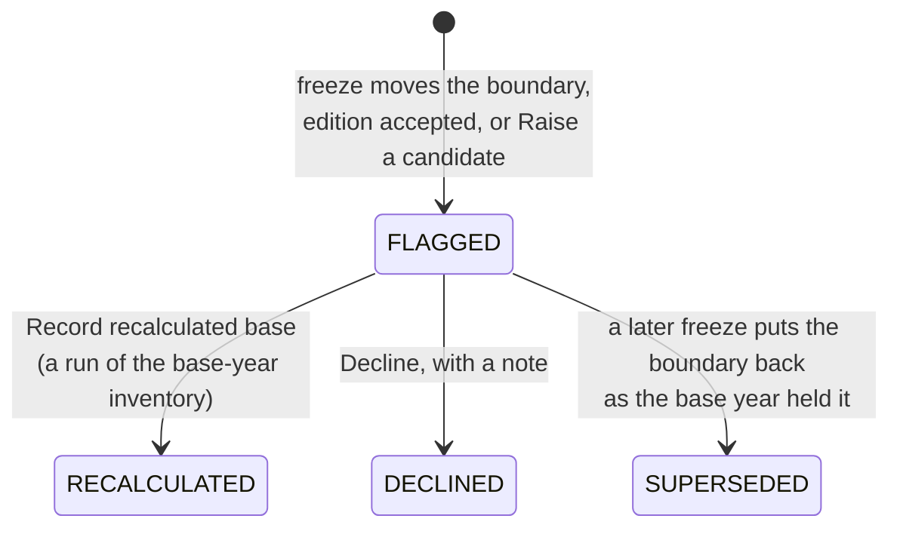

# What is the base year?

The base year is the year later inventories are compared against; its figure is the final run of the inventory you designate. Chapter 5 of the Corporate Standard asks you to recalculate it when a change makes the comparison unfair; CarbonOS keeps that question as a candidate.

<!-- sources: specs 06 and 06.1; old page concepts/base-year-and-recalculation.md (verified 2026-09-24); frontend/src/features/ghg/BaseYearPage.tsx; frontend/src/features/ghg/RunDetailPage.tsx (section 07); backend/src/main/java/com/carbonos/ghg/internal/BaseYear.java (the threshold applied to each change and to the cumulative effect); backend/src/main/java/com/carbonos/ghg/internal/BaseYearService.java; backend/src/main/java/com/carbonos/ghg/internal/InventoryService.java (the hold) -->

## What does the significance threshold do?

The threshold is the share of base-year emissions a change may affect before recalculation is required, "applied to each change and to the cumulative effect since the base year": a candidate is weighed alone and with the outstanding earlier ones, declined ones included, so small changes can cross the line together. Below it a candidate reads "recalculation optional"; above it, "recalculation required".

## What raises a candidate?

| Trigger | Example | Raised by |
| --- | --- | --- |
| Structural change | A site sold or acquired, a membership window changed. | A freeze whose boundary differs from the base year's, weighed by the affected facilities' share. |
| Methodology change | A new factor vintage or calculation method. | Accepting a factor pack update, or **Raise a candidate**. |
| Significant error corrected | A quantity or factor found wrong in the base year. | **Raise a candidate**, with the share or a comparison run. |

Organic growth or decline, and a facility that did not exist in the base year, never trigger one. A candidate above the threshold holds the final designation and publication of every inventory that reports against the base year; runs stay available, because quantifying the movement is how the recalculation is assessed.

## What does a recalculation do?

Recording a recalculated base names a run of the base-year inventory, usually from a correction, as the figure later years compare against; the earlier runs are kept, and section 07 prints both and the history. Declining keeps the base year as it stands, with your note; either decision releases the hold. A candidate raised by a boundary change is superseded when a later freeze puts the boundary back.

## Where next

- [Designate the base year](designate-the-base-year.md)
- [Decide a recalculation candidate](decide-a-recalculation-candidate.md)
- [Correct a published inventory](correct-a-published-inventory.md)
