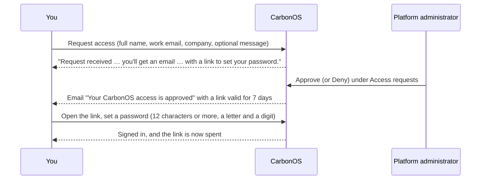

# Request access and set your password

**Role needed:** none. This is how an account starts.

An account is created either by a platform administrator under
**Users**, who gives you a temporary password out of band, or by an
access request you make yourself, which an administrator approves.

<!-- sources: HomePage.tsx; landing/intent.ts; RequestAccessModal.tsx; SetPasswordPage.tsx; AdminAccessRequestsPage.tsx; approval email; specs 01.1, 01.2; verified 2026-09-27 -->

## Request access

1. Open CarbonOS. The landing page reads "The GHG inventory that
   survives verification." with **Sign in** and **Request access** in
   the top bar. On a phone, **Sign in** sits in the top bar's menu
   instead. Click **Request access**.
2. Fill **Full name**, **Work email**, **Company (optional)** and, if
   you like, **Anything we should know? (optional)**.
3. Click **Request access**.

What you see: "Request received. Thanks, *name*. Your request is with
our team. Once it is approved you will get an email with a link to set
your password at *email*."

The landing page's other buttons open the same form under a different
title: **Ask about the pilot**, **Request a licence** and **Talk to
ECORIV**. Those send the same request, marked with what you asked for,
and their confirmation says that ECORIV usually replies by email
within 48 hours rather than promising a password link. An administrator sees what
you asked for, and your message, next to your name.

## Set your password

1. When an administrator approves the request, you receive the email
   "Your CarbonOS access is approved": "Set your password to activate
   your account (the link is valid for 7 days)". Open the link.
2. The page reads "Welcome, *name*. Choose a password for *email*."
   Fill **New password** and **Confirm password**: "At least 12
   characters, with a letter and a digit."
3. Click **Set password and sign in**.

What you see: you are signed in. A member of no organization lands on
**GHG accounting** with **New organization**; a member of one
organization lands in it; an administrator lands on the console.

The link works once. Opening it again reads "This link is invalid or
has expired. Access links are valid for 7 days; you can always request
access again."

## Sign in later

**Sign in** on the landing page takes **Email** and **Password**.

## Edit your profile

The account menu at the top right (your initial or picture) offers
**Edit profile** and **Sign out**. **Edit profile** takes a **Display
name**, shows your **Email**, and lets you **Upload picture** ("PNG,
JPEG, or WebP · up to 5 MB"). Click **Save changes**.

## An account an administrator created

The administrator gives you the temporary password out of band and you
sign in with it. Change it afterwards through the administrator: the
profile page does not change passwords.
